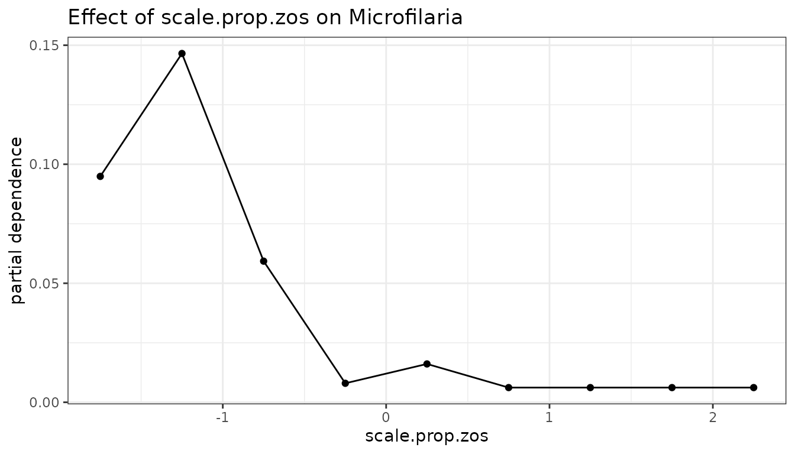
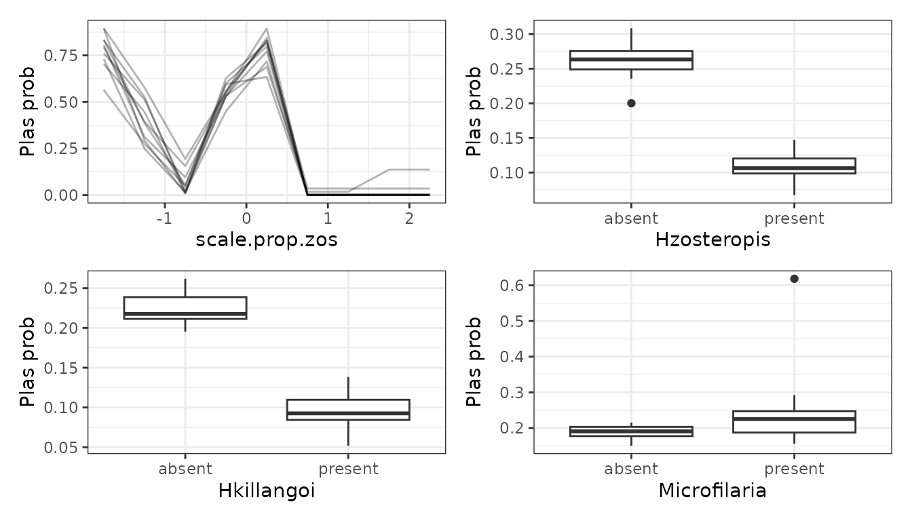

# mrIML

`mrIML` is a package for interpretable machine learning in R,
specifically designed for multivariate (or multi-response) data. It
provides tools for building and interpreting multi-response models using
the [`tidymodels`](https://www.tidymodels.org/start/) syntax; making it
very useful for applications in community ecology and ecological
genomics.

``` r
library(mrIML)
library(tidymodels)
library(flashlight)
library(ggplot2)
library(patchwork)

set.seed(7007)
```

Here we demonstrate a basic `mrIML` workflow using the `Bird.parasites`
data set from the `MRFcov` package. This data set contains binary
occurrences of four blood parasite species–*Hzosteropis, Hkillangoi,
Plas, and Microfilaria*–in New Caledonian birds and a scaled continuous
variable representing host relative abundance: *scale.prop.zos*.

``` r
data <- MRFcov::Bird.parasites
head(data)
#> # A tibble: 6 × 5
#>   Hzosteropis Hkillangoi  Plas Microfilaria scale.prop.zos
#>         <dbl>      <dbl> <dbl>        <dbl>          <dbl>
#> 1           0          0     0            0          -1.09
#> 2           0          0     0            0          -1.09
#> 3           0          0     0            0          -1.09
#> 4           0          0     0            0          -1.09
#> 5           0          0     0            0          -1.09
#> 6           0          0     0            0          -1.09
```

To fit a multi-response models, we must first separate the data into the
responses, the variables we wish to predict, and the covariates, the
variables used only as predictors.

``` r
# Responses
Y <- select(data, "Hzosteropis", "Hkillangoi", "Plas", "Microfilaria")
# Covariates
X <- select(data, "scale.prop.zos")
```

Many of the functions in the `mrIML` wrokflow that follows can be
greatly sped up by using parallel processing. To do this, we just need
to set up a cluster using the `future` package.

``` r
future::plan(multisession, workers = 2)
```

## Fitting a mrIML model

The first step in the `mrIML` workflow is to define some models that we
would like to compare. Thanks to `tidymodels`, we can define a wide
range of models using a unified syntax. To demonstrate, we are going to
set up two models to compare: a random forest model (RF) and a logistic
regression (lm).

``` r
model_rf <- rand_forest(
  trees = 100, # 100 trees are set for brevity. Aim to start with 1000.
  mode = "classification",
  mtry = tune(),
  min_n = tune()
) %>%
  set_engine("randomForest")

model_lm <- logistic_reg() %>%
  set_engine("glm")
```

The models can then be fit as multi-response models using
[`mrIMLpredicts()`](https://github.com/nickfountainjones/mrIML/reference/mrIMLpredicts.md),
which is the work horse of the `mrIML` package.
[`mrIMLpredicts()`](https://github.com/nickfountainjones/mrIML/reference/mrIMLpredicts.md)
fits the supplied tidymodel to each response variables. The `X1`
argument can be used to supply any response variables that we would like
to also use as predictors; which results in a co-ocurance model (in this
case we use all the response variables).

``` r
mrIML_rf <- mrIMLpredicts(
  X = X,
  Y = Y,
  X1 = Y,
  Model = model_rf,
  prop = 0.7,
  k = 5,
  racing = TRUE
)
#> i Creating pre-processing data to finalize 1 unknown parameter: "mtry"
#> i Creating pre-processing data to finalize 1 unknown parameter: "mtry"
#> i Creating pre-processing data to finalize 1 unknown parameter: "mtry"
#> i Creating pre-processing data to finalize 1 unknown parameter: "mtry"

mrIML_lm <- mrIMLpredicts(
  X = X,
  Y = Y,
  X1 = Y,
  Model = model_lm , 
  balance_data = 'no',
  prop = 0.6,
  k = 5,
  racing = FALSE
)
#> → A | warning: glm.fit: fitted probabilities numerically 0 or 1 occurred
#> There were issues with some computations   A: x1
#> There were issues with some computations   A: x1
#> 
```

The resulting fitted `mrIML` model is a list object containing the
original tidy model, the data, and the fitted response models. The
remainder of the functions in the `mrIML` package are aimed at
interrogating, explaining, and comparing these fitted `mrIML` models.

## Model performance and comparison

[`mrIMLperformance()`](https://github.com/nickfountainjones/mrIML/reference/mrIMLperformance.md)
is another core function in `mrIML` used to extract performance metrics
for each of the fitted response models inside the multi-response `mrIML`
model.

``` r
perf_rf <- mrIML_rf %>%
  mrIMLperformance()
perf_rf$model_performance
#> # A tibble: 4 × 8
#>   response     model_name roc_AUC   mcc sensitivity   ppv specificity prevalence
#>   <chr>        <chr>        <dbl> <dbl>       <dbl> <dbl>       <dbl>      <dbl>
#> 1 Hzosteropis  rand_fore…   0.931 0.649       0.93  0.894       0.694     0.265 
#> 2 Hkillangoi   rand_fore…   0.780 0.171       0.975 0.893       0.125     0.116 
#> 3 Plas         rand_fore…   0.850 0.555       0.917 0.909       0.630     0.196 
#> 4 Microfilaria rand_fore…   0.921 0.44        0.967 0.928       0.4       0.0980

perf_lm <- mrIML_lm %>%
  mrIMLperformance()
perf_rf$model_performance
#> # A tibble: 4 × 8
#>   response     model_name roc_AUC   mcc sensitivity   ppv specificity prevalence
#>   <chr>        <chr>        <dbl> <dbl>       <dbl> <dbl>       <dbl>      <dbl>
#> 1 Hzosteropis  rand_fore…   0.931 0.649       0.93  0.894       0.694     0.265 
#> 2 Hkillangoi   rand_fore…   0.780 0.171       0.975 0.893       0.125     0.116 
#> 3 Plas         rand_fore…   0.850 0.555       0.917 0.909       0.630     0.196 
#> 4 Microfilaria rand_fore…   0.921 0.44        0.967 0.928       0.4       0.0980
```

These performance metrics can be compared between different `mrIML`
model using
[`mrPerformancePlot()`](https://github.com/nickfountainjones/mrIML/reference/mrPerformancePlot.md).

``` r
perf_comp <- mrPerformancePlot(perf_rf, perf_lm)
perf_comp$performance_plot + perf_comp$performance_diff_plot
```


## Interogating models

To explore the effect of predictors on the different response models,
`mrIML` works closely with the
[`flashlight`](https://mayer79.github.io/flashlight/index.html) package,
particularly their implementation of
[`flashlight::light_profile()`](https://rdrr.io/pkg/flashlight/man/light_profile.html)
to generate partial dependency curves (PDs) for model agnostic
comparisons. The
[`mrFlashlight()`](https://github.com/nickfountainjones/mrIML/reference/mrFlashlight.md)
function can be used to convert a `mrIML` model into a `flashlight`
object in order to apply most of the `flashlight` functions.

``` r
fl_rf <- mrIML_rf %>%
  mrFlashlight()

fl_rf$Microfilaria %>%
  light_profile(data = data, v = "scale.prop.zos") %>%
  plot() +
  ggtitle("Effect of scale.prop.zos on Microfilaria") +
  theme_bw()
```



[`mrCovar()`](https://github.com/nickfountainjones/mrIML/reference/mrCovar.md)
is a wrapper around
[`mrFlashlight()`](https://github.com/nickfountainjones/mrIML/reference/mrFlashlight.md)
and
[`flashlight::light_profile()`](https://rdrr.io/pkg/flashlight/man/light_profile.html)
to quickly compare the effect of a predictive covariate across the many
response models.

``` r
PD_scale.prop.zos_rf <- mrIML_rf %>%
  mrCovar(var = "scale.prop.zos", sdthresh = 0)

PD_scale.prop.zos_rf[[1]] /
  PD_scale.prop.zos_rf[[2]] /
  PD_scale.prop.zos_rf[[3]] +
  plot_layout(axis = "collect")
```


Since PDs are model agnostic, we can use them for any kind of predictive
model. For example we can compare the RF model results above directly
with the LM bellow. We could even compare a Neural Net if we had enough
data to fit it!

``` r
PD_scale.prop.zos_lm <- mrIML_lm %>%
  mrCovar(var = "scale.prop.zos", sdthresh = 0)

PD_scale.prop.zos_lm[[1]] /
  PD_scale.prop.zos_lm[[2]] /
  PD_scale.prop.zos_lm[[3]] +
  plot_layout(axis = "collect")
```


The variability in the response probability across a PD curve can be
used to rank variable importance in each response model. On this basis,
[`mrVip()`](https://github.com/nickfountainjones/mrIML/reference/mrVip.md)
compares variable importance across the response models inside a `mrIML`
model.

``` r
vip_rf <- mrIML_rf %>%
  mrVip()

vip_rf[[3]]
```


If there are many response models and/or covariates, the `threshold`,
`global_top_var`, and `local_top_var` arguments can be used to filter
the variable importance results that are plotted by `mrVip`. The `taxa`
argument can also be used to plot a desired response model that may not
fit the filtering criteria. See `?mrVip()` for the specifics of these
arguments.

## Bootstrapping for uncertainty

To quantify uncertainty in a `mrIML` model, the function
[`mrBootstrap()`](https://github.com/nickfountainjones/mrIML/reference/mrBootstrap.md)
bootstraps the PDs. The output can then be passed to
[`mrPdPlotBootstrap()`](https://github.com/nickfountainjones/mrIML/reference/mrPdPlotBootstrap.md)
to visualize the PDs.

``` r
mrIML_boot_rf <- mrIML_rf %>%
  mrBootstrap()
#>   |                                                                              |                                                                      |   0%  |                                                                              |==                                                                    |   2%  |                                                                              |====                                                                  |   5%  |                                                                              |=====                                                                 |   8%  |                                                                              |=======                                                               |  10%  |                                                                              |=========                                                             |  12%  |                                                                              |==========                                                            |  15%  |                                                                              |============                                                          |  18%  |                                                                              |==============                                                        |  20%  |                                                                              |================                                                      |  22%  |                                                                              |==================                                                    |  25%  |                                                                              |===================                                                   |  28%  |                                                                              |=====================                                                 |  30%  |                                                                              |=======================                                               |  32%  |                                                                              |========================                                              |  35%  |                                                                              |==========================                                            |  38%  |                                                                              |============================                                          |  40%  |                                                                              |==============================                                        |  42%  |                                                                              |================================                                      |  45%  |                                                                              |=================================                                     |  48%  |                                                                              |===================================                                   |  50%  |                                                                              |=====================================                                 |  52%  |                                                                              |======================================                                |  55%  |                                                                              |========================================                              |  58%  |                                                                              |==========================================                            |  60%  |                                                                              |============================================                          |  62%  |                                                                              |==============================================                        |  65%  |                                                                              |===============================================                       |  68%  |                                                                              |=================================================                     |  70%  |                                                                              |===================================================                   |  72%  |                                                                              |====================================================                  |  75%  |                                                                              |======================================================                |  78%  |                                                                              |========================================================              |  80%  |                                                                              |==========================================================            |  82%  |                                                                              |============================================================          |  85%  |                                                                              |=============================================================         |  88%  |                                                                              |===============================================================       |  90%  |                                                                              |=================================================================     |  92%  |                                                                              |==================================================================    |  95%  |                                                                              |====================================================================  |  98%  |                                                                              |======================================================================| 100%

mrPdPlotBootstrap(
  mrIML_rf,
  mrBootstrap_obj = mrIML_boot_rf,
  target = "Plas",
  global_top_var = 4
)[[2]]
```



After bootstrapping the PDs, the bootstrap information can be supplied
to
[`mrVip()`](https://github.com/nickfountainjones/mrIML/reference/mrVip.md)
to include uncertainty bounds in the plots.

``` r
vip_boot_rf <- mrVip(
  mrIMLobj = mrIML_rf,
  mrBootstrap_obj = mrIML_boot_rf
)

vip_boot_rf[[3]]
```


## Checking for interactions

Another helpful investigative tool is `mrInteraction()`. This function
quickly identifies which response models have strong evidence of
interactions between predictors, which predictors have the most
interactive effects, and which interactions are the strongest.

``` r
interactions_rf <- mrIML_rf %>%
  mrInteractions(feature = "Plas", num_bootstrap = 10)

interactions_rf[[1]] /
  interactions_rf[[2]] /
  interactions_rf[[3]]
```


